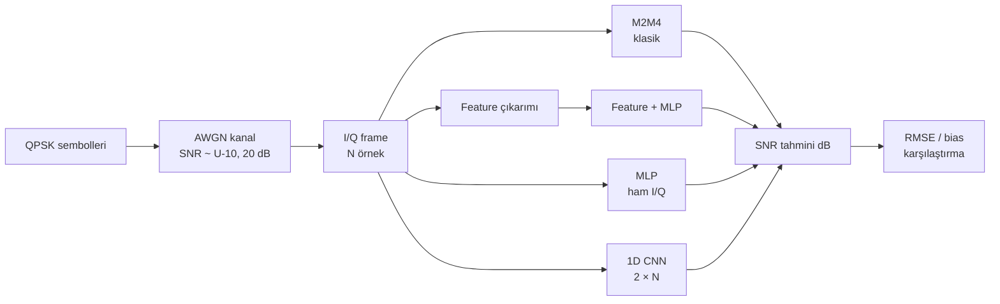
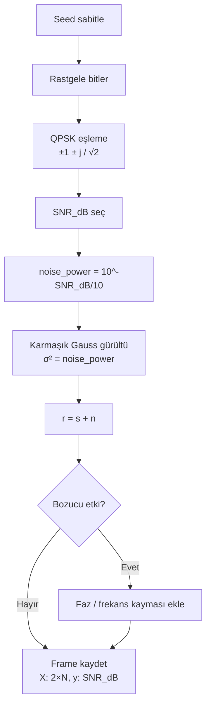
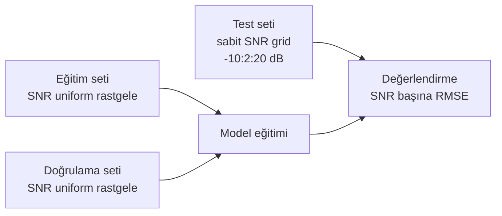
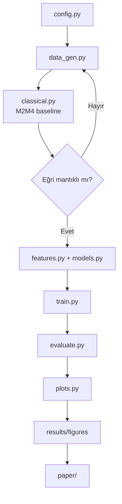

# Akış Şemaları

GitHub bu şemaları otomatik olarak çizer (Mermaid).

---

## 1. Genel Pipeline

```mermaid
flowchart LR
    A[QPSK sembolleri] --> B[AWGN kanal<br/>SNR ~ U-10, 20 dB]
    B --> C[I/Q frame<br/>N örnek]
    C --> D1[M2M4<br/>klasik]
    C --> D2[Feature çıkarımı] --> D2b[Feature + MLP]
    C --> D3[MLP<br/>ham I/Q]
    C --> D4[1D CNN<br/>2 × N]
    D1 --> E[SNR tahmini dB]
    D2b --> E
    D3 --> E
    D4 --> E
    E --> F[RMSE / bias<br/>karşılaştırma]
```

---

## 2. Veri Üretimi

```mermaid
flowchart TD
    S[Seed sabitle] --> A[Rastgele bitler]
    A --> B[QPSK eşleme<br/>±1 ± j / √2]
    B --> C[SNR_dB seç]
    C --> D[noise_power = 10^-SNR_dB/10]
    D --> E[Karmaşık Gauss gürültü<br/>σ² = noise_power]
    E --> F[r = s + n]
    F --> G{Bozucu etki?}
    G -- Hayır --> H[Frame kaydet<br/>X: 2×N, y: SNR_dB]
    G -- Evet --> I[Faz / frekans kayması ekle] --> H
```

---

## 3. Veri Setleri

```mermaid
flowchart LR
    A[Eğitim seti<br/>SNR uniform rastgele] --> M[Model eğitimi]
    B[Doğrulama seti<br/>SNR uniform rastgele] --> M
    C[Test seti<br/>sabit SNR grid<br/>-10:2:20 dB] --> E[Değerlendirme<br/>SNR başına RMSE]
    M --> E
```

---

## 4. Deney Akışı

```mermaid
flowchart TD
    A[config.py] --> B[data_gen.py]
    B --> C[classical.py<br/>M2M4 baseline]
    C --> D{Eğri mantıklı mı?}
    D -- Hayır --> B
    D -- Evet --> E[features.py + models.py]
    E --> F[train.py]
    F --> G[evaluate.py]
    G --> H[plots.py]
    H --> I[results/figures]
    I --> J[paper/]
```
